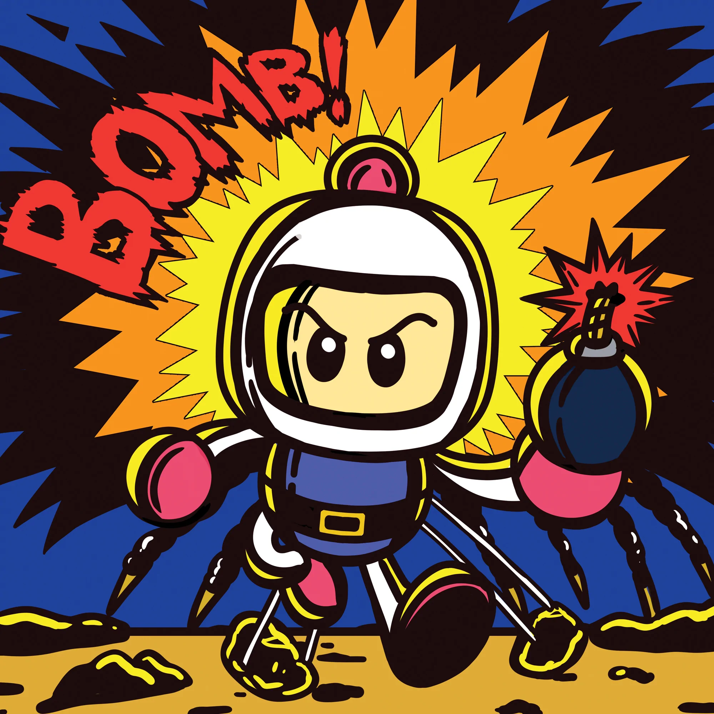

<!-- PROJECT LOGO -->
 

  

  <h3 align="center">OOP BOMBERMAN PROJECT</h3>
  <h4 align="center">Team Name: Berserk</h4>

<!-- TABLE OF CONTENTS -->
# Table of contents 
1. [Introduction](#Introduction)
2. [Game](#Game)
3. [UML-class-diagram](#UML-class-diagram)
4. [Features](#Features)
5. [Challenges](#Challenges)
6. [Acknowledgments](#Acknowledgments)
7. [References](#References)
<!-- 

  
Table of Contents

  <ol>
    <li>
      <a href="#Introduction">Introduction</a>
      <ul>
        <li><a href="#Team-members">Team Members</a></li>
	<li><a href="#installation">Installation</a></li>
	<li><a href="#motivation">Motivation</a></li>
	<li><a href="#task-allocation">Task Allocation</a></li>      
      </ul>
    </li>
    <li><a href="#technologies">Technologies</a></li>
    <li><a href="#uml-class-diagram">UML Class Diagram</a></li>
    <li><a href="#features">Features</a></li>
    <li><a href="#challenges">Challenges</a></li>
    <li><a href="#acknowledgments">Acknowledgments</a></li>
    <li><a href="#references">References</a></li>
  </ol>

 -->

<!-- ABOUT THE PROJECT -->

## Introduction  :bricks:

This is our game project for our Object-Oriented Programming course. Bomberman is an individual game that does not require players have excellent skills or advanced technology. It's a straightforward game that may be enjoyed by people of all ages. As a result of all of these factors, we developed a program that is user-friendly and assists users in having the greatest possible experiences. So, what are we waiting for? Let the story begin!

### Team Members :couplekiss_man_man:

| Order |      Name       |     MSV     |           Email            |                       Github account                        |
| :---: |:---------------:|:-----------:|:--------------------------:|:-----------------------------------------------------------:|
|   1   | Truong Gia Ngoc |  21020369   |  ngoctruonggia@gmail.com   |          [cognaiger](https://github.com/cognaiger)           |
|   2   | Pham Gia Phong  | ITITIU20165 | hoangbao15082002@gmail.com | [Mr@JEY](https://github.com/PhanNguyenHoangBao-ITITIU20165) |

### Motivation :mechanical_arm:

As a fresher developer, we assume that the Bomberman game is one of the most simple game which helps us in practicing coding with OOP also some significant aspects of the front-end such as: How to render the game? , How frame working in UX/UI? , ….

<!-- Game -->
 

## Game :joystick:
### Technologies :globe_with_meridians:

- Language: [JAVA](https://www.java.com/en/)
- Framework: [IntelliJ](https://www.jetbrains.com/idea/)
- Library: [FXGL](https://github.com/AlmasB/FXGL)

### How to play ? :video_game:

Players will direct the character's movement in order to place bombs to killing the enemy. After the player has killed all enemies of this level a portal will open for the character to enter in order to advance to the next level (we have 3 levels).

### Game logic :bulb:

- Character: The character is controlled by button WASD, press SPACE to place bomb. Moreover ,The character will increase strength if he absorbs item.

 

- Bomb : When the bomb explodes, it will create a fire flames, if the character or the enemy hits the fire flames, they will all be destroyed. The length of the flame will increase if the character eats flameitem

 

- Enemy: includes 6 types and is divided by level, each type has its own appearance and attribute.

 

- Brick : it Can be broken by bombs and can contain items

 

- Wall : it cannot be broken to limit the movement of characters and enemies

 

## UML Class Diagram:clipboard:
<!--  -->

	<h3>1. CONTROL</h3>
    

        
    

     
	
------------------------------------

     
	<h3>2. ENTITY</h3>
    <h4>a) Animal</h4>
    

        
    

    <h4>b) Intelligent with "Doll" enemy</h4>
    

        
    

    <h4>c) Block</h4>
    

        
    

    <h4>d) Items</h4>
    

        
    

    <h4>e) Items with Entity</h4>
    

        
    

    <h4>f) Animal with Entity</h4>
    

        
    

	
------------------------------------

	<h3>3. FEATURES</h3>
    

        
    

     
	
------------------------------------

	<h3>4. GAMERUNNER</h3>
    

        
    

     
	
------------------------------------

	<h3>5. GRAPHICS</h3>
    

        
    

     
	
------------------------------------

	<h3>6. LEVELS</h3>
    

        
    

     
    
------------------------------------

 

<!-- FEATURES -->
## Features<a name="Features"> :triangular_flag_on_post:
- Completed: Basic logic, UX/UI, sound of game
- Incompleted: 2 players, multiplayer through Internet, AI for auto playing…
 

<!-- CHALLENGES -->
## Challenges<a name="Challenges">:bangbang:

- Task allocation for each team member
- Communication
- Working environment (Github)
 

## References<a name="References">  :eye::tongue::eye:
1. [FXGL tutorials](https://webtechie.be/post/2020-05-07-getting-started-with-fxgl/)
2. [FXGL documents](https://almasb.github.io/FXGL/)

 

(<a href="#top">Back to top</a>)

<!-- MARKDOWN LINKS & IMAGES -->
<!-- https://www.markdownguide.org/basic-syntax/#reference-style-links -->

[contributors-shield]: https://img.shields.io/github/contributors/Nhathuy1305/OOP_BOMBERMAN_GAME.svg?style=for-the-badge
[contributors-url]: https://github.com/Nhathuy1305/OOP_BOMBERMAN_GAME/graphs/contributors
[forks-shield]: https://img.shields.io/github/forks/Nhathuy1305/OOP_BOMBERMAN_GAME.svg?style=for-the-badge
[forks-url]: https://github.com/Nhathuy1305/OOP_BOMBERMAN_GAME/network/members
[stars-shield]: https://img.shields.io/github/stars/Nhathuy1305/OOP_BOMBERMAN_GAME.svg?style=for-the-badge
[stars-url]: https://github.com/Nhathuy1305/OOP_BOMBERMAN_GAME/stargazers
[issues-shield]: https://img.shields.io/github/issues/Nhathuy1305/OOP_BOMBERMAN_GAME.svg?style=for-the-badge
[issues-url]: https://github.com//Nhathuy1305/OOP_BOMBERMAN_GAME/issues

